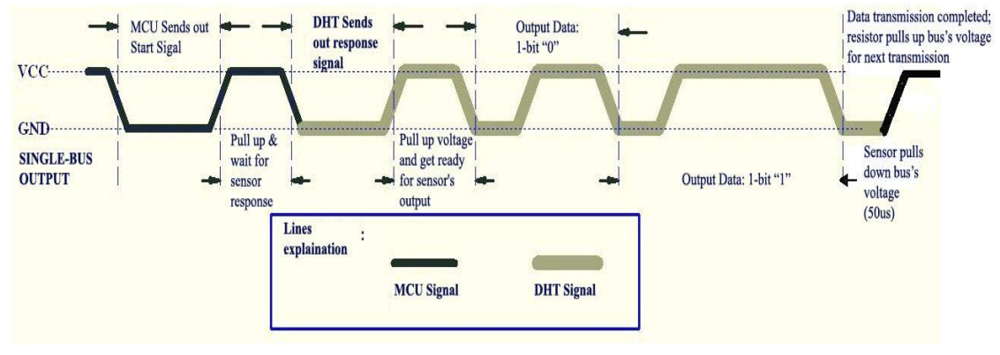

# STM32_DHT11_interfacing
# Delay
Since we need delay in micro seconds and the given HAL_Delay() function gives us a delay of 1ms the following function has been declared
```c
void microsecond_delay (uint16_t us)
{
	__HAL_TIM_SET_COUNTER(&htim1,0);  // set the counter value a 0
	while ((uint16_t)(__HAL_TIM_GET_COUNTER(&htim1)) < us);
}
```
## DHT11 Temperature and Humidity Sensor

The **DHT11** is a widely used sensor for measuring temperature and humidity. It comes equipped with an 8-bit microprocessor that outputs temperature and humidity values as serial data. Additionally, it features a specialized NTC (Negative Temperature Coefficient) thermistor for temperature measurement.

### Key Features

- Factory calibrated sensor for easy integration with other microcontrollers.
- Temperature measurement accuracy: ±1°C.
- Humidity measurement accuracy: ±1%.
- Temperature measurement range: 0°C to 50°C.
- Humidity measurement range: 20% to 90%.

For monitoring temperature and humidity in a variety of applications, such as weather stations, home automation systems, and environmental monitoring, the DHT11 sensor is an affordable and dependable option.

## Pin Configuration

The DHT11 sensor typically has three pins:

1. **VCC**: Connect to a 3.3V or 5V power supply.
2. **Data (or Signal)**: Connect to a digital input pin on your microcontroller.
3. **GND**: Connect to the ground of your power supply.

## Working

To initialize the DHT11 sensor, you need to follow these steps:

1. Set the data pin as an output.
2. Pull the data pin low for 18 milliseconds.
3. Release the data pin by setting it as an input.

Here is the function for the same:

```c
void Sensor_start (void)
{
    Set_Pin_Output ();  // Set the pin as an output
    HAL_GPIO_WritePin (DHT11_PORT, DHT11_PIN, 0);   // Pull the pin low
    microsecond_delay (18000);   // Wait for 18ms
    Set_Pin_Input();    // Set as input
}

```
## Detecting DHT11 Sensor Presence

To determine if the DHT11 sensor is present and responsive, follow these steps after sending the start signal:

1. Pull the data line low for 80 microseconds.
2. Pull the data line high for another 80 microseconds.

To read the sensor's response:

1. Wait for 40 microseconds.
2. Read the data pin; it must be low at this point.
3. Wait for 80 microseconds.
4. Read the data pin again; this time it should be HIGH.

If these conditions are met, it indicates that the DHT11 sensor is present and ready to provide data.

the function for the same is as follows 
```c
uint8_t Sensor_response (void)
{
	uint8_t Response = 0;
	microsecond_delay (40);
	if (!(HAL_GPIO_ReadPin (DHT11_PORT, DHT11_PIN)))
	{
		microsecond_delay (80);
		if ((HAL_GPIO_ReadPin (DHT11_PORT, DHT11_PIN))) Response = 1;
		else Response = -1;
	}
	while ((HAL_GPIO_ReadPin (DHT11_PORT, DHT11_PIN)));   // wait for the pin to go low

	return Response;
}
```
## DHT11 Data Transmission

The DHT11 sensor transmits data by sending 40 bits of information. Each bit's transmission begins with a low-voltage level that lasts for 50 microseconds. The length of the subsequent high-voltage level signal determines whether the bit is a "0" or a "1."

- If the high-voltage level is around 26-28 microseconds, the bit is considered "0."
- If the high-voltage level lasts around 70 microseconds, the bit is interpreted as "1."

The 40 bits sent by the DHT11 sensor include the following components:

- 8 bits for integral relative humidity (RH) data.
- 8 bits for decimal RH data.
- 8 bits for integral temperature (T) data.
- 8 bits for decimal T data.
- 8 bits for a checksum.

The checksum is calculated based on the previous 32 bits of data and should match the last 8 bits of "8 bit integral RH data + 8 bit decimal RH data + 8 bit integral T data + 8 bit decimal T data." This checksum serves as a data integrity check to ensure the received data is accurate.

This data transmission process is crucial for extracting temperature and humidity information from the DHT11 sensor.

the function for the same is as follows
```c
#define read_bits(x) (1<<(7-x))//macro to store the data bits read 
uint8_t Read_data (void)
{
	uint8_t i,j;
	for (j=0;j<8;j++)
	{
		while (!(HAL_GPIO_ReadPin (DHT11_PORT, DHT11_PIN)));   // wait for the pin to go high
		microsecond_delay (40);   // wait for 40 us
		if (!(HAL_GPIO_ReadPin (DHT11_PORT, DHT11_PIN)))   // if the pin is low
		{
			i^= read_bits(j);   // write 0
		}
		else i|= read_bits(j);;  // if the pin is high, write 1
		while ((HAL_GPIO_ReadPin (DHT11_PORT, DHT11_PIN)));  // wait for the pin to go low
	}
	return i;
}
```
## Reading Data from DHT11 Sensor

To extract data from the DHT11 sensor, follow these steps:

1. Wait for the data pin to go high.
2. Wait for 40 microseconds. The duration of this delay helps distinguish between "0" and "1" bits in the transmitted data.

After these steps, you can proceed to read and record the respective values from the sensor.

These steps are essential for correctly interpreting the data transmitted by the DHT11 sensor.

the function for the same is as follows
```c
// Structure to store sensor data
typedef struct sensor_values {
    uint8_t humidity_HB;
    uint8_t humidity_LB;
    uint8_t temperature_HB;
    uint8_t temperature_LB;
    uint8_t checksum;
} sensor_val;

// Function to print DHT11 sensor data
void print_dht11_data(void)
{	uint8_t sum;
	uint8_t buffer[] = "error";
	sensor_val dht11;
	Sensor_start();
	if (Sensor_response>0)
	{
		dht11.humidity_HB = Read_data();
		dht11.humidity_LB = Read_data();
		dht11.temperature_HB = Read_data();
		dht11.temperature_LB = Read_data();
		dht11.checksum = Read_data();
		sum = dht11.humidity_HB+dht11.humidity_LB+dht11.temperature_HB+dht11.temperature_LB;
		if (sum == dht11.checksum)
		{

			dht11.humidity_HB = binaryToDecimal(dht11.humidity_HB);
			dht11.temperature_HB = binaryToDecimal(dht11.temperature_HB );
			print(dht11.humidity_HB);
			print(dht11.temperature_HB);

		}
		else
			CDC_Transmit_FS(buffer,sizeof(buffer));
	}

}

```